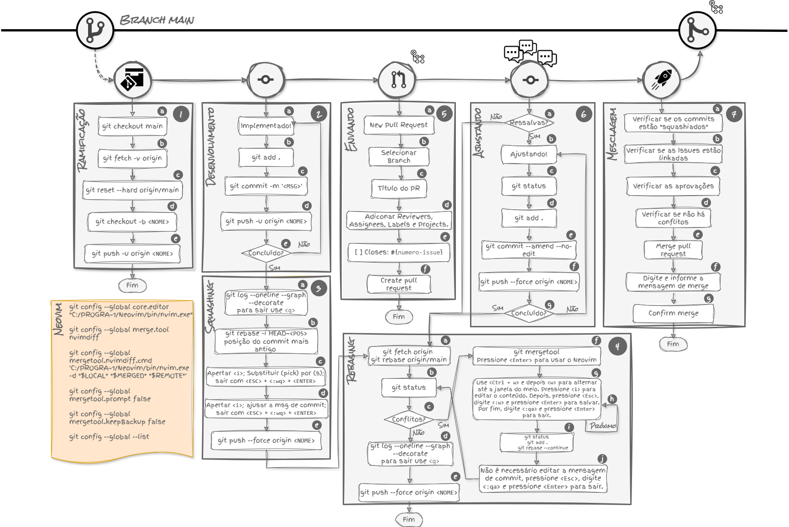

<h1>CONTRIBUINDO</h1>

A sua participação é essencial para o sucesso deste projeto e estamos muito felizes com seu interesse em contribuir. Para tornar o processo simples e agradável, preparamos algumas diretrizes que o ajudarão a colaborar de forma eficaz.

<!-- ---------------------------------- -->
<!-- COMO PARTICIPAR -->
<!-- ---------------------------------- -->
<h2>Como Participar</h2>

Este projeto adota um fluxo de desenvolvimento baseado em branches, o que facilita o trabalho em equipe e permite que todos colaborem de maneira organizada. Para começar, clone o repositório e crie uma nova branch<picture></picture> para realizar suas alterações<picture></picture>. Ao concluir, lembre-se de usar squash<picture></picture> e rebase<picture></picture> para manter sua branch atualizada. Depois, envie um pull request<picture></picture> para que outros membros possam revisar suas contribuições e sugerir melhorias. Após incorporar<picture></picture> as sugestões, faça um rebase<picture></picture> final. Assim, sua contribuição estará pronta para ser integrada<picture></picture> ao repositório principal.

<!-- ---------------------------------- -->
<!-- FLUXO DE DESENVOLVIMENTO -->
<!-- ---------------------------------- -->
<h2>Fluxo de Desenvolvimento</h2>

Nosso objetivo é garantir que todo o processo de desenvolvimento seja eficiente e produtivo. Caso encontre algum termo novo ou tenha dúvidas em qualquer parte, não hesite em pedir ajuda. Estamos aqui para apoiar uns aos outros e garantir que sua contribuição seja a melhor possível!

    
   
Fluxo de Desenvolvimento Baseado em Branches.

<!-- ================================== -->
<!-- FLUXO DE DESENVOLVIMENTO - 1. RAMIFICAÇÃO -->
<h3><picture></picture> Ramificação</h3>

Acesse o diretório do projeto e verifique se está na branch principal, garantindo que você esteja na branch <code>main</code>. Caso não esteja, use o comando abaixo para alternar <picture></picture> para ela:

<pre><code><em>git checkout main</em></code></pre> 

Em seguida, busque<picture></picture> as atualizações do repositório remoto para garantir que você tenha as últimas alterações feitas por outros colaboradores. Use o comando:

<pre><code><em>git fetch -v origin</em></code></pre>

Depois, sincronize<picture></picture> sua branch local com a branch principal do repositório remoto para receber as últimas mudanças. Execute o comando:

<pre><code><em>git reset --hard origin/main</em></code></pre> 
<strong>
Nota:</strong> Use o <code>git reset --hard</code> com cautela, pois ele descartará qualquer alteração não confirmada.

Para iniciar seu trabalho, é importante criar<picture></picture> uma nova branch, garantindo que seu código não interfira diretamente na branch principal. Use o seguinte comando para criar e alternar para a nova branch:

<pre><code><em>git checkout -b &lt;NOME&gt;</em></code></pre>

É fundamental que o <code>&lt;NOME&gt;</code> da branch siga um padrão de nomenclatura claro para evitar problemas futuros, garantindo que o nome da branch não seja rejeitado pelo sistema de validação automatizada de CI (<a href="./workflows/nomenclatura-branch.yml">CHECK - Nomenclatura de Branch</a>). A não conformidade com esse padrão resultará no bloqueio do seu Pull Request. Para assegurar consistência e compreensão, o nome da branch deve começar com o prefixo <code>feature/</code> ou <code>fix/</code>, dependendo se o objetivo é adicionar uma nova funcionalidade ou corrigir um bug. Além disso, é obrigatório que o restante do nome seja composto apenas por letras minúsculas, utilizando hífens <code>&lt;-&gt;</code> para separar palavras, evitando espaços ou caracteres especiais. Seguir esse padrão simplifica a organização do projeto e facilita a revisão de código. Por exemplo:

<blockquote>
   
💡 <strong>Dica:</strong>

   
Aqui estão alguns exemplos de nomes de branch válidos:

   <ul>
      <li><code><em>git checkout -b feature/adicionar-perfil-usuario</em></code></li>
      <li><code><em>git checkout -b fix/corrigir-erro-login</em></code></li>
   </ul>
</blockquote>

Após criar a branch, é hora de enviá-la<picture></picture> para o repositório remoto. Para isso, utilize o seguinte comando:

<pre><code><em>git push -u origin &lt;NOME&gt;</em></code></pre>
<!-- ================================== -->
<!-- FLUXO DE DESENVOLVIMENTO - 2. DESENVOLVIMENTO -->
<h3><picture></picture> Desenvolvimento</h3>

Com a nova branch criada, você pode começar a implementar suas alterações<picture></picture>. À medida que realiza modificações no código, lembre-se de adicioná-las<picture></picture> ao controle de versão utilizando o seguinte comando:

<pre><code><em>git add .</em></code></pre>

Após adicionar as alterações, é importante criar um commit para registrar <picture></picture> seu progresso. É <strong>obrigatório</strong> utilizar o formato de mensagens de commit baseado no <strong>Conventional Commits</strong> para manter um histórico claro e consistente. Além disso, o projeto conta com um sistema de validação automatizada de CI (<a href="./workflows/mensagem-commit-descritiva.yml">CHECK - Mensagem de Commit Descritiva</a>), que exige o uso de mensagens de commit descritivas e padronizadas. Caso tenha dúvidas sobre como proceder, consulte o tópico <a href="#mensagem-de-commit-descritiva">Mensagem de Commit Descritiva</a> na seção de <a href="#boas-práticas-ao-contribuir">Boas Práticas ao Contribuir</a>. Aqui está um exemplo de como criar um commit:

<pre>
<em>git commit -m "&lt;type&gt;(scope): &lt;description&gt;</em>
<small>linha separadora</small>
<em>&lt;body&gt;</em>
<small>linha separadora</small>
<em>&lt;footer(s)&gt;"</em>
</pre>

Depois de registrar suas mudanças, você pode enviá-las<picture></picture> para o repositório remoto com o comando:

<pre><code><em>git push -u origin &lt;NOME&gt;</em></code></pre>

Lembre-se de fazer commits com frequência, sempre que atingir um ponto importante ou quando tiver feito uma mudança significativa.

<!-- ================================== -->
<!-- FLUXO DE DESENVOLVIMENTO - 3. SQUASHING -->
<h3><picture></picture> Squashing</h3>

Durante o desenvolvimento, é comum criar vários commits pequenos. No entanto, antes de finalizar seu trabalho e enviar uma Pull Request, é uma boa prática combinar esses commits em um único, mantendo o histórico mais organizado.

Primeiro, visualize<picture></picture> o histórico dos commits usando:

<pre><code><em>git log --oneline --graph --decorate</em></code></pre>
<blockquote>
   
💡 <strong>Dica:</strong>

   
Esse comando exibirá uma visão gráfica e simplificada do histórico de commits. Para sair dessa visualização, pressione <strong>q</strong>.

</blockquote>

Para combinar os commits, inicie<picture></picture> o rebase interativo, onde você poderá escolher os commits que deseja combinar. Especifique a posição do commit mais antigo que deseja agrupar:

<pre><code><em>git rebase -i HEAD~&lt;POS&gt;</em></code></pre>
<blockquote>
   
⚠️ <strong>Atenção:</strong>

   
Substitua <strong>&lt;POS&gt;</strong> pela posição do commit mais antigo que deseja incluir no rebase. Por exemplo, use <code>HEAD~3</code> para incluir os últimos 3 commits.

</blockquote>

Após iniciar o rebase interativo, a tela do <strong>Vim</strong> será apresentada, exibindo uma lista dos commits que você selecionou. Aqui, você pode agrupar<picture></picture> os commits seguindo estes passos:

<ol>
   <li>Pressione <strong>i</strong> para entrar no modo de inserção.</li>
   <li>Substitua <strong>pick</strong> por <strong>s</strong> (de <strong>squash</strong>) nos commits que deseja combinar.</li>
   <li>Após realizar as substituições, pressione <strong>ESC</strong> para sair do modo de inserção.</li>
   <li>Para salvar e sair, digite <code>:wq</code> e pressione <strong>ENTER</strong>.</li>
</ol>

Depois disso, uma nova tela do <strong>Vim</strong> será aberta, permitindo que você ajuste<picture></picture> a mensagem do commit resultante. A mensagem de commit deve seguir o padrão <strong>Conventional Commits</strong>, o que ajuda a manter um histórico claro e organizado dos commits. Novamente, pressione <strong>i</strong> para entrar no modo de inserção e ajuste a mensagem conforme necessário. Ao finalizar as alterações, salve e saia do editor usando a sequência:

<pre><code><em>:wq</em></code></pre>

Por fim, envie<picture></picture> o commit agrupado para o repositório remoto, forçando a atualização:

<pre><code><em>git push --force origin &lt;NOME&gt;</em></code></pre>
<!-- ================================== -->
<!-- FLUXO DE DESENVOLVIMENTO - 4. REBASING -->
<h3><picture></picture> Rebasing</h3>

O principal objetivo é atualizar a branch com as alterações mais recentes da branch <strong>main</strong>. Além disso, essa técnica realoca seu commit para o topo do histórico, resultando em um formato linear que torna o histórico de commits mais limpo e fácil de entender.

Para começar, busque<picture></picture> as alterações mais recentes da branch <code>main</code> com o comando:

<pre><code><em>git fetch origin</em></code></pre>

Em seguida, inicie<picture></picture> o processo de rebase:

<pre><code><em>git rebase origin/main</em></code></pre>

Após iniciar o rebase, verifique<picture></picture> o status da operação para identificar se há conflitos:

<pre><code><em>git status</em></code></pre>

Se houver conflitos, siga os passos abaixo para resolvê-los:

<ol>
   <li>
      
Inicie<picture></picture> a ferramenta de merge para resolver os conflitos:

      <pre><code><em>git mergetool</em></code></pre>
      
Pressione <strong>Enter</strong> para usar o Neovim como editor de merge.

   </li>
   <li>
      
Para resolver<picture></picture> os conflitos:

      <ul>
         <li>Use <strong>Ctrl + w</strong> e depois <strong>w</strong> para alternar para a janela do meio.</li>
         <li>Pressione <strong>i</strong> para entrar no modo de edição e ajuste o conteúdo conforme necessário.</li>
         <li>Após fazer suas alterações, pressione <strong>Esc</strong>, digite <code>:w</code> e pressione <strong>Enter</strong> para salvar.</li>
         <li>Por fim, digite <code>:qa</code> e pressione <strong>Enter</strong> para sair. Esse processo pode ser repetido dependendo da quantidade de arquivos com conflitos.</li>
      </ul>
   </li>
   <li>
      
Após resolver<picture></picture> todos os conflitos, verifique o status novamente:

      <pre><code><em>git status</em></code></pre>
   </li>
   <li>
      
Adicione<picture></picture> as alterações resolvidas ao controle de versão com o comando:

      <pre><code><em>git add .</em></code></pre>
   </li>
   <li>
      
Continue<picture></picture> o processo de rebase:

      <pre><code><em>git rebase --continue</em></code></pre>
   </li>
   <li>
      
Não é necessário editar<picture></picture> a mensagem de commit nesta etapa. Para sair do editor, pressione <strong>Esc</strong>, digite <code>:qa</code> e pressione <strong>Enter</strong>.

   </li>
   <li>
      
Volte ao início<picture></picture> desta etapa para verificar se não há mais conflitos a serem resolvidos.

   </li>
</ol>

Se não houver conflitos:

<ol>
   <li>
      
Visualize<picture></picture> o histórico de commits com:

      <pre><code><em>git log --oneline --graph --decorate</em></code></pre>
      <blockquote>
         
💡 <strong>Dica:</strong> Para sair dessa visualização, pressione <strong>q</strong>.

      </blockquote>
   </li>
   <li>
      
Em seguida, envie<picture></picture> suas alterações para o repositório remoto:

      <pre><code><em>git push --force origin &lt;NOME&gt;</em></code></pre>
   </li>
</ol>
<!-- ================================== -->
<!-- FLUXO DE DESENVOLVIMENTO - 5. ENVIANDO -->
<h3><picture></picture> Enviando</h3>

Após concluir o desenvolvimento, o próximo passo é abrir<picture></picture> um <strong>Pull Request (PR)</strong> para que suas mudanças possam ser revisadas. No GitHub, clique em "New Pull Request" e selecione a branch que contém as alterações realizadas.

Escolha <picture></picture> a branch em que você trabalhou e que será enviada para revisão. Certifique-se de estar enviando para a branch correta.

Adicione<picture></picture> um título claro e objetivo ao Pull Request, que reflita de forma concisa o que foi feito, ajudando os revisores a entender rapidamente o conteúdo. O título deve seguir as convenções de mensagens semânticas, começando com um tipo de mudança, como <strong>feat:</strong> para novas funcionalidades, <strong>fix:</strong> para correções de bugs, <strong>docs:</strong> para alterações de documentação, <strong>style:</strong> para mudanças de estilo, <strong>refactor:</strong> para refatoração de código, <strong>test:</strong> para adição ou correção de testes, e <strong>chore:</strong> para tarefas de manutenção. O título deve ser escrito em letras minúsculas, utilizando hífens para separar palavras, como em <code>feat: implementar sistema de autenticação de usuários</code>. É importante que o título seja escrito no modo imperativo e transmita a mudança de forma clara, pois será validado por CI (<a href="./workflows/titulo-pull-request.yml">CHECK - Título de Pull Request</a>).

Você poderá adicionar <picture></picture> revisores, atribuir responsáveis (<strong>assignees</strong>), aplicar <strong>labels</strong> relevantes (como bug, feature, etc.), e vincular o PR a <strong>projects</strong> existentes para um melhor rastreamento.

Se o seu Pull Request estiver relacionado a uma issue, é fundamental que você utilize<picture></picture> a sintaxe <code>Closes: #{numero_issue}</code>. Isso garante que a issue será fechada automaticamente quando o Pull Request for aprovado e mergeado. Além disso, é importante observar que há um CI específico (<a href="./workflows/issues-linkadas-pull-request.yml">CHECK - Issues linkadas a Pull Request</a>) que verifica se essa referência está presente. A falta dessa referência pode resultar no bloqueio do seu Pull Request, portanto, sempre inclua o número da issue para garantir a conformidade com as diretrizes do projeto.

<pre><code>Closes: #42</code></pre>

Depois de preencher todos os campos corretamente, revise os detalhes e clique em <strong>Create Pull Request</strong> para submeter<picture></picture> o PR para a revisão da equipe.

<!-- ================================== -->
<!-- FLUXO DE DESENVOLVIMENTO - 6. AJUSTANDO -->
<h3><picture></picture> Ajustando</h3>

Se houver sugestões ou ressalvas <picture></picture> na revisão, aplique os ajustes necessários no código. Verifique se há solicitações de mudança e inicie <picture></picture> as alterações conforme solicitado.

Use o comando abaixo para verificar <picture></picture> o status das modificações:

<pre><code><em>git status</em></code></pre>

Adicione <picture></picture> todas as mudanças realizadas no controle de versão com o comando:

<pre><code><em>git add .</em></code></pre>

Para realizar o commit <picture></picture> com uma alteração da mensagem anterior, sem modificar a descrição, utilize:

<pre><code><em>git commit --amend --no-edit</em></code></pre>

Envie <picture></picture> suas alterações ao repositório remoto forçando a atualização:

<pre><code><em>git push --force origin &lt;NOME&gt;</em></code></pre>

Verifique<picture></picture> se todas as alterações foram implementadas e o código atende às solicitações dos revisores. Se as alterações não estiverem completas, volte ao passo <picture></picture> e continue ajustando o código até que esteja pronto.

<!-- ================================== -->
<!-- FLUXO DE DESENVOLVIMENTO - 7. MESCLAGEM -->
<h3><picture></picture> Mesclagem</h3>

Este fluxo representa a etapa final do processo de desenvolvimento, atuando como um checklist para garantir que tudo esteja em ordem antes de mesclar as alterações. Este checklist ajuda a garantir que todas as etapas importantes foram seguidas antes de finalizar o desenvolvimento, prevenindo erros e conflitos futuros.

Confirme que todos os commits foram combinados (squashiados) <picture></picture> de forma adequada, resultando em um histórico limpo e organizado.

Certifique-se de que todas as <em>issues</em> relacionadas ao trabalho realizado estão devidamente referenciadas e linkadas <picture></picture> no pull request. Isso ajuda a rastrear as mudanças no projeto.

Confira se todos os revisores necessários aprovaram <picture></picture> o pull request. Certifique-se de que não há conflitos <picture></picture> entre sua branch e a branch de destino <code>main</code>, resolvendo-os se necessário antes de continuar.

Inicie o processo de mesclagem, clicando em "Merge pull request" <picture></picture> no GitHub ou em outra ferramenta de controle de versão.

Ao mesclar, informe a mensagem <picture></picture> de <strong>merge</strong> seguindo o padrão de mensagens do <strong>Conventional Commits</strong>. Isso mantém o histórico de alterações claro e consistente.

Finalize a operação clicando em "Confirm merge" <picture></picture> para concluir a integração das mudanças no repositório.

<!-- ---------------------------------- -->
<!-- BOAS PRÁTICAS AO CONTRIBUIR -->
<!-- ---------------------------------- -->
<h2>Boas Práticas ao Contribuir</h2>
<!-- ================================== -->
<!-- BOAS PRÁTICAS AO CONTRIBUIR - MENSAGEM DE COMMIT DESCRITIVA -->
<h3>Mensagem de Commit Descritiva</h3>

Adotamos o padrão de <strong>Conventional Commits</strong> para estruturar nossas mensagens de commit. Esse modelo garante que cada commit seja descritivo e fácil de entender, utilizando palavras-chave específicas que indicam o tipo de mudança. Cada mensagem de commit é composta por um <strong>header</strong>, um <strong>body</strong> e um <strong>footer</strong>, todos separados por uma linha em branco. O formato geral é:

<pre>
<em>&lt;type&gt;(optional scope): &lt;description&gt;</em>
<small>linha separadora</small>
<em>&lt;optional body&gt;</em>
<small>linha separadora</small>
<em>&lt;optional footer(s)&gt;</em>
</pre>

O header é obrigatório e segue um formato específico que inclui um type, um scope e um subject. Os types devem ser um dos seguintes: feat, fix, build, chore, ci, docs, style, refactor, perf ou test. O scope é opcional e, se informado, deve estar entre parênteses e ser uma palavra que represente o caso de uso. O subject é obrigatório e deve ser escrito em letras minúsculas. Além disso, todo o texto do header não pode ultrapassar 50 caracteres.

<pre>
<code><em>git commit -m "feat(auth): remover suporte para autenticação via cookies"</em></code>
</pre>

Embora o body seja opcional, é recomendável preenchê-lo, pois isso torna as mensagens mais legíveis e compreensíveis ao revisar o histórico do projeto. Essas seções também são utilizadas para gerar o log de alterações. Cada linha do body deve ter, no máximo, 100 caracteres.

<pre>
<code><em>git commit -m "feat(auth): remover suporte para autenticação via cookies</em>
</small>
<em>A autenticação agora é feita exclusivamente por meio de tokens JWT, que
oferecem maior segurança e flexibilidade. Essa mudança é
necessária para atender aos novos requisitos de segurança."</em></code>
</pre>

No caso do footer, você pode adicionar um <code>!</code> antes do <code>:</code> para indicar que há uma quebra de compatibilidade. Nesse caso, será necessário informar o <code>BREAKING CHANGE</code>. Cada linha do footer também não pode ultrapassar 100 caracteres.

<pre>
<code><em>git commit -m "feat(auth)!: remover suporte para autenticação via cookies</em>
</small>
<em>A autenticação agora é feita exclusivamente por meio de tokens JWT, que
oferecem maior segurança e flexibilidade. Essa mudança é
necessária para atender aos novos requisitos de segurança.</em>
</small>
<em>BREAKING CHANGE: a autenticação por cookies foi descontinuada. Os usuários
devem usar tokens JWT para se autenticar. Atualizações na documentação
foram feitas para refletir essa alteração."</em></code>
</pre>

Se não houver quebra de compatibilidade, basta adicionar apenas o footer. Você pode usar várias opções, dependendo do que deseja comunicar. Aqui estão algumas das principais opções que podem ser utilizadas no footer:

<pre>
<code><em>git commit -m "feat(auth)!: remover suporte para autenticação via cookies"</em>
</small>
<em>A autenticação agora é feita exclusivamente por meio de tokens JWT, que
oferecem maior segurança e flexibilidade. Essa mudança é
necessária para atender aos novos requisitos de segurança.</em>
</small>
<em>Fixes #456</em>
<em>Closes #123</em>
<em>Refs #789</em>
<em>Reviewed-by: Mantenedor &lt;mantenedor@example.com&gt;</em>
<em>Note: Atualização na documentação necessária."</em></code>
</pre>

Esse formato proporciona clareza e facilita a colaboração e manutenção do projeto, ajudando todos os membros da equipe a entender as mudanças implementadas ao longo do tempo. Para mais detalhes sobre essa convenção, consulte a <a href="https://www.conventionalcommits.org/en/v1.0.0/"><strong>documentação oficial</strong></a>.

<!-- ================================== -->
<!-- BOAS PRÁTICAS AO CONTRIBUIR - GERAR VERSÕES DO SOFTWARE -->
<h3>Gerar Versões do Software</h3>

Adotamos a especificação do <strong>SemVer</strong>, que define um conjunto de regras para a atribuição e incremento de números de versão de software. Esta convenção estabelece práticas para atribuir números de versão (major, minor e patch) com base na natureza das mudanças realizadas no código, avaliando as mensagens de commit. O formato geral é:

<pre>
<b>MAJOR.MINOR.PATCH</b>
</pre>

Os commits que geram alteração de versão, como <strong>feat</strong> e <strong>fix</strong>, impactam diretamente o comportamento da aplicação, exigindo modificações no código-fonte. Por outro lado, outros tipos de commits, como <strong>docs</strong>, <strong>style</strong>, <strong>chore</strong>, <strong>test</strong>, <strong>build</strong>, <strong>ci</strong>, <strong>refactor</strong> e <strong>perf</strong>, não alteram a versão, pois se referem a mudanças internas, melhorias de documentação ou ajustes de infraestrutura.

Essa combinação do <strong>Conventional Commits</strong> com <strong>SemVer</strong> permite que o versionamento seja feito automaticamente com base nos commits. Cada tipo de commit pode indicar qual parte do versionamento deve ser ajustada. Por exemplo, considere que a versão inicial seja <code>1.0.0</code> e que ocorram, nessa ordem, uma correção de funcionalidade, seguida de uma evolução de funcionalidade e uma quebra de compatibilidade.

   <table border="1" cellpadding="10" cellspacing="0">
   <thead>
      <tr>
         <th>Tipo de Commit</th>
         <th>Impacto na Versão</th>
         <th>Exemplo</th>
         <th>Descrição</th>
      </tr>
   </thead>
   <tbody>
      <tr>
         <td><strong>fix</strong></td>
         <td>Atualiza o PATCH</td>
         <td><code>1.0.0</code> para <code>1.0.1</code></td>
         <td>Correção de funcionalidade</td>
      </tr>
      <tr>
         <td><strong>feat</strong></td>
         <td>Atualiza o MINOR</td>
         <td><code>1.0.1</code> para <code>1.1.0</code></td>
         <td>Evolução de funcionalidade</td>
      </tr>
      <tr>
         <td><strong>BREAKING CHANGE</strong></td>
         <td>Atualiza o MAJOR</td>
         <td><code>1.1.0</code> para <code>2.0.0</code></td>
         <td>Quebra de compatibilidade</td>
      </tr>
   </tbody>
   </table>

Além disso, temos um processo de CI (<a href="./workflows/gerar-versoes-software.yml">RELEASE - Gerar Versões do Software</a>) que avalia as mensagens de commit e, ao enviar para a branch principal, realiza o incremento da versão. Esse processo também mantém atualizado o arquivo <a href="./CHANGELOG.md">CHANGELOG</a> com as modificações da aplicação, garantindo que todos os detalhes das alterações sejam documentados.

Esse processo facilita o rastreamento das mudanças e assegura a compatibilidade adequada entre versões. Para mais detalhes, consulte a <a href="https://semver.org/" target="_blank"><strong>documentação oficial</strong></a>.

<!-- ================================== -->
<!-- BOAS PRÁTICAS AO CONTRIBUIR - CODE STYLE -->
<h3>Code Style</h3>

Para garantir que o código permaneça organizado e padronizado, utilizamos ferramentas de formatação que devem ser configuradas na sua IDE. Veja <a href="./docs/ide.md">aqui</a> as configurações necessárias para o desenvolvimento. Essas ferramentas ajudam a manter um estilo de código consistente, facilitando a revisão e a colaboração entre desenvolvedores, além de evitar discrepâncias no estilo do código.

   <strong>Nota:</strong> Manter um estilo de código consistente é fundamental para a legibilidade e a manutenção do projeto. Sempre verifique as configurações recomendadas para as ferramentas de formatação que você está utilizando.

<!-- ---------------------------------- -->
<!-- CONTRIBUIÇÕES VALIOSAS -->
<!-- ---------------------------------- -->
<h2>Contribuições Valiosas</h2>

Toda forma de contribuição é bem-vinda. Existem várias maneiras de ajudar, mesmo sem escrever uma única linha de código. Aqui estão algumas maneiras de colaborar:

Se você encontrou algum erro ou problema 🐛 no projeto, sua ajuda será muito apreciada! <a href="../../../issues/new?assignees=&labels=bug%2Ctriage&projects=&template=01-bug-report.yml&title=%5BBug%5D%3A+">Relate o bug</a> para nos ajudar a melhorar o sistema. Caso tenha uma ideia para uma nova funcionalidade ou uma grande melhoria 🚀, adoraríamos <a href="../../../issues/new?assignees=&labels=enhancement&projects=&template=02-feature-request.yml&title=%5BFeature%5D%3A+">ouvir sua sugestão</a> e evoluirmos juntos. Além disso, se notar algo na documentação 📝 que pode ser aprimorado, seja na ortografia, na gramática ou em explicações que possam ser mais claras, <a href="../../../issues/new?assignees=&labels=documentation&projects=&template=03-documentation.yml&title=%5BDocumentação%5D%3A+">contribua</a> com suas correções. E se tiver qualquer dúvida ❓, estamos <a href="../../../issues/new?assignees=&labels=question&projects=&template=04-question.yml&title=%5BQuestion%5D%3A+">aqui</a> para ajudar!

<!-- ---------------------------------- -->
<!-- CONDUTA -->
<!-- ---------------------------------- -->
<h2>Conduta</h2>

Nosso objetivo é promover um ambiente de colaboração saudável e acolhedor. Pedimos que todas as interações sejam realizadas de forma respeitosa e construtiva. Se você observar qualquer comportamento inadequado ou violação de nossas diretrizes, consulte o <a href="./CODE_OF_CONDUCT.md">Código de Conduta</a> para mais informações e entre em contato diretamente com a equipe de <a href="../../../graphs/contributors">mantenedores</a>.

<!-- ---------------------------------- -->
<!-- SUPORTE E DÚVIDAS -->
<!-- ---------------------------------- -->
<h2>Suporte e Dúvidas</h2>

Se você tiver alguma dúvida durante o processo ou precisar de ajuda para realizar sua contribuição, nossa equipe está à disposição para orientá-lo. Não hesite em nos procurar!

<strong>Sua contribuição faz a diferença!</strong>
