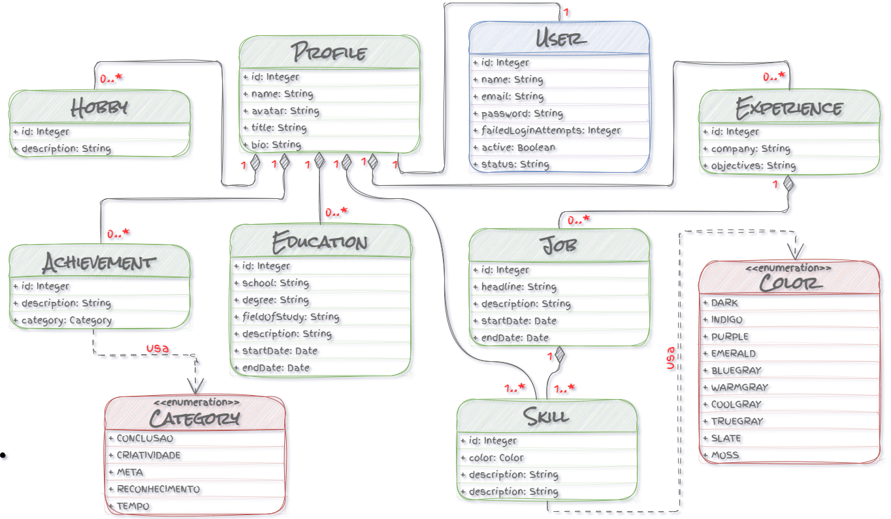
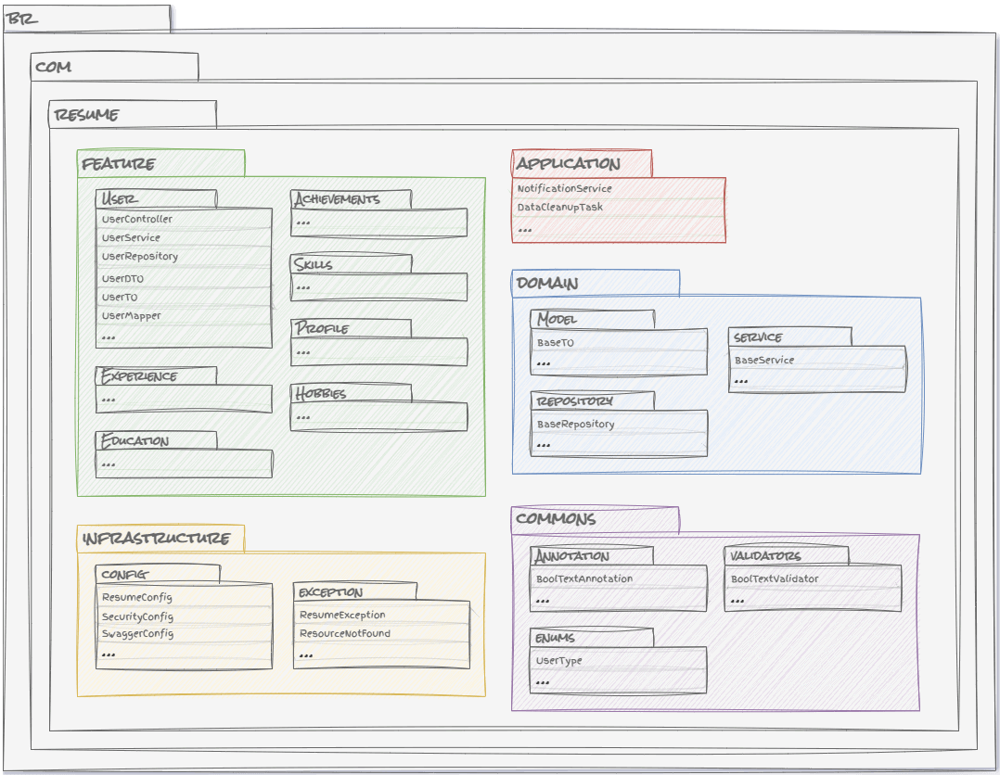

<div align="justify">
    <div align="center">
        <picture>
            
        </picture>
    </div>
    <hr>
    <h3>1. ABSTRACT</h3>
    <p>
        <em>
        This project aims to provide web services that enable users to easily access and manage their professional and personal information. At the core of this initiative is a robust <strong>RESTful API</strong>, designed for seamless integration with various applications to enhance user experience and ensure efficient data management. Prioritizing <strong>usability</strong>, <strong>security</strong>, and <strong>flexibility</strong>, this platform is especially appealing to professionals seeking to enhance their online presence. By consolidating essential information, users can effectively highlight their skills and experiences, thereby increasing their visibility in the job market. The Resume project offers a comprehensive suite of features for managing <strong>Achievements</strong>, <strong>Education</strong>, <strong>Experience</strong>, <strong>Hobbies</strong>, <strong>Profile</strong>, <strong>Skills</strong>, and <strong>User</strong> data, allowing users to intuitively maintain and access their information. Ideal for those looking to improve their personal branding, Resume ensures a secure and personalized experience that simplifies the effective presentation of skills.
        </em>
    </p>
    <p>
        Este projeto tem como objetivo fornecer serviços na web que permitem aos usuários acessar e gerenciar suas informações profissionais e pessoais de forma simples. No centro do projeto está uma <strong>API RESTful</strong> robusta, projetada para facilitar a integração com diversas aplicações, melhorando a experiência do usuário e garantindo uma gestão de dados eficiente. A plataforma prioriza <strong>usabilidade</strong>, <strong>segurança</strong> e <strong>flexibilidade</strong>, sendo
        especialmente atraente para profissionais que desejam aumentar sua presença online. Ao consolidar informações essenciais, os usuários podem destacar suas habilidades e experiências de forma eficaz, aumentando sua visibilidade no mercado de trabalho. O projeto Resume oferece um conjunto abrangente de recursos para gerenciar <strong>Conquistas</strong>, <strong>Educação</strong>, <strong>Experiência</strong>, <strong>Hobbies</strong>, <strong>Perfil</strong>, <strong>Habilidades</strong> e
        dados de <strong>Usuários</strong>, permitindo que os usuários mantenham e acessem suas informações de maneira intuitiva. Ideal para quem busca aprimorar sua marca pessoal, o Resume garante uma experiência segura e personalizada, que simplifica a apresentação eficaz das habilidades.
    </p>
    <h3>2. STATUS OF THIS PROJECT</h3>
    <p>
        <em>
        This project is part of the studies undertaken in the Web and Mobile Development - Full Stack specialization, where various relevant technological resources were explored, as outlined in the course syllabus. Currently, the project is in a phase of continuous improvement, with core functionalities fully functional. The development team is focused on continuous improvements aimed at enhancing user experience through features that increase interactivity and responsiveness. Recent updates have introduced improvements in loading speed, responsiveness, and dynamic customization options. Future plans include adding more interactive elements, expanding customization, and continually optimizing performance for a seamless user experience.
        </em>
    </p>
    <p>
        Este projeto faz parte dos estudos realizados na especialização em Desenvolvimento Web e Mobile - Full Stack, onde foram abordados diversos recursos tecnológicos relevantes, conforme a ementa do curso. O projeto encontra-se atualmente em fase de aprimoramento contínuo, com as principais funcionalidades já operacionais. A equipe de desenvolvimento está focada em melhorias contínuas, voltadas para aprimorar a experiência do usuário por meio de recursos que aumentam a interatividade e a responsividade. As atualizações recentes trouxeram melhorias na velocidade de carregamento, responsividade e opções de personalização dinâmica. Estão planejados aprimoramentos futuros para introduzir mais elementos interativos, expandir a personalização e otimizar
        continuamente o desempenho para uma experiência de usuário fluida.
    </p>
    <h3>3. CLIENTES</h3>
    <div>
        <div>
            <picture>
                
            </picture>
            <p>
                Acesse <a href="https://resume.vercel.app/">resume.vercel.app</a>. Nossa aplicação web é uma interface moderna e intuitiva que permite aos usuários interagir com a <strong>API RESTful Resume</strong>. Com design responsivo, a plataforma oferece uma experiência fluida para gerenciar informações profissionais e pessoais. Confira o repositório em <a href="https://github.com/danylo-macelai/resume-web">Resume Web</a> e veja também as pessoas <a href="https://github.com/danylo-macelai/resume-web?tab=readme-ov-file#cases">que já aderiram</a> a essa transformação profissional!
            </p>
        </div>
        <div>
            <picture>
                
            </picture>
            <p>
                O aplicativo mobile Resume proporciona uma experiência moderna e intuitiva, permitindo aos usuários interagir eficientemente com a <strong>API RESTful Resume</strong>. Disponível para download na <a href="#">Play Store</a>, o app tem design responsivo que facilita o gerenciamento de informações profissionais e pessoais. Confira o repositório em <a href="https://github.com/danylo-macelai/resume-mobile">Resume Mobile</a> e destaque suas habilidades de forma prática!
            </p>
        </div>
    </div>
    <h3>4. ARQUITETURA DO SISTEMA</h3>
    <p>
        A arquitetura da <strong>API RESTful</strong> foi desenvolvida com <strong>Java</strong> e <strong>Spring Boot</strong>, combinando padrões robustos e boas práticas para garantir uma estrutura escalável e eficiente. O padrão <strong>MVC</strong> organizou a aplicação, onde controladores gerenciaram requisições HTTP, serviços encapsularam a lógica de negócios e entidades representaram os dados. O uso do padrão <strong>Repositório</strong> com <strong>Spring Data JPA</strong> simplificou
        o acesso ao banco de dados, permitindo operações CRUD e a transferência segura de dados. A implementação de <strong>HATEOAS</strong> facilitou a navegação entre os recursos, enquanto uma documentação clara e o versionamento da API asseguraram que os desenvolvedores pudessem utilizar a interface de forma eficaz. Medidas de segurança, como autenticação e tratamento de erros, também foram aplicadas para proteger os dados e melhorar a experiência do usuário. Outras práticas, como paginação
        e o uso correto de métodos HTTP, contribuíram para uma interação intuitiva e consistente. Juntas, essas abordagens mantiveram a API organizada, manutenível e de fácil consumo, promovendo tanto a clareza quanto a segurança.
    </p>
    <div align="center">
        <picture>
            
        </picture>
        <p><sup>Diagrama de Classes</sup></p>
    </div>
    <h3>5. ESTRUTURA DE ARQUIVOS</h3>
    <p>A escolha da organização por feature, em vez de por camada técnica, oferece vantagens significativas para a manutenção e evolução de sistemas complexos. Ao agrupar as classes de acordo com as funcionalidades do negócio, em vez de separá-las por preocupações técnicas, o código se torna mais fácil de entender e de gerenciar, já que todas as classes relacionadas a uma funcionalidade específica ficam localizadas em um único pacote. Isso melhora a visibilidade da lógica de negócios, facilitando a identificação e modificação de uma funcionalidade sem o risco de impactar outras partes do sistema de forma indesejada. Além disso, esse modelo permite uma evolução mais independente de diferentes funcionalidades, reduzindo a complexidade e aumentando a testabilidade, já que as dependências entre as funcionalidades são minimizadas. Embora haja o custo de duplicação de código, a abordagem "Package by Feature" evita o uso excessivo de abstrações complexas, tornando o código mais simples e alinhado às necessidades específicas de cada caso de uso.</p>
    <blockquote>
        <p>⚠️ <strong>Atenção:</strong></p>
        <p>Para evitar duplicação de arquivos mantendo a organização por funcionalidades, aplique a <a href="https://en.wikipedia.org/wiki/Rule_of_three_(computer_programming)" target="_blank">Regra dos Três (Three strikes and you refactor")</a>, que sugere refatorar o código apenas quando ele for duplicado três vezes. No início, é aceitável manter algumas repetições, mas ao atingir a terceira instância, deve-se avaliar se o código pode ser extraído para uma classe ou método reutilizável, sem comprometer a clareza.</p>
    </blockquote>
    <div align="center">
        <picture>
            
        </picture>
        <p><sup>Package by Feature</sup></p>
    </div>
    <h3>6. COMO EXECUTAR O PROJETO</h3>
    <p>Este projeto utiliza o Java 17 e o Spring Boot 3.5.0, que conta com um servidor embutido (Tomcat) para facilitar a execução independente da aplicação. O banco de dados H2 está configurado para operar em modo de arquivo, eliminando a necessidade de instalação manual. O <strong>Maven Wrapper</strong> garante que todos os desenvolvedores usem a mesma versão do Maven, o que simplifica a configuração e assegura a consistência do ambiente de desenvolvimento.</p>
    <blockquote>
        <p>⚠️ <strong>Atenção:</strong></p>
        <p>Os comandos sugeridos são compatíveis com Windows Terminal ou PowerShell. Caso utilize um terminal diferente, pode ser necessário realizar ajustes para adequá-los ao seu ambiente.</p>
    </blockquote>
    <p>Antes de prosseguir, verifique se o <strong>JDK 17</strong> está instalado em seu sistema, executando o comando:</p>
    <pre><code><em>java -version</em></code></pre>
    <p>Se o JDK 17 não estiver instalado, faça o download <a href="https://www.oracle.com/java/technologies/javase-jdk17-downloads.html" target="_blank">aqui</a> e siga as instruções da <a href="https://docs.oracle.com/en/java/javase/17/install/overview-installing-java-se-17.html" target="_blank">documentação oficial da Oracle</a>.</p>
    <p>Para clonar o repositório, você também precisará do <strong>Git Bash</strong>. Verifique se ele está instalado com:</p>
    <pre><code><em>git --version</em></code></pre>
    <p>Caso o Git Bash não esteja instalado, faça o download <a href="https://gitforwindows.org/" target="_blank">aqui</a> e siga o guia de instalação oficial do <a href="https://gitforwindows.org/" target="_blank">Git for Windows</a>.</p>
    <p>Para organizar o projeto, crie um diretório de trabalho em um local de sua preferência para armazenar o código-fonte. Um exemplo de comando para criar a pasta no terminal:</p>
    <pre><code><em>mkdir C:\WORKSPACES\RESUME\RESUME-API</em></code></pre>    
    <p>Em seguida, acesse o diretório criado com o comando:</p>
    <pre><code><em>cd C:\WORKSPACES\RESUME\RESUME-API</em></code></pre>
    <p>Depois, clone o repositório do projeto com o comando:</p>
    <pre><code><em>git clone https://github.com/danylo-macelai/resume-api.git</em></code></pre>
    <p>Após a clonagem, acesse a pasta do projeto com:</p>
    <pre><code><em>cd .\resume-api\</em></code></pre>
    <p>Para iniciar o projeto usando o Maven Wrapper (mvnw), execute o comando abaixo no diretório do projeto. Esse comando fará o download das dependências e iniciará o servidor Tomcat embutido:</p>
   
```bash
$env:DATASOURCE_USERNAME="UResume"
$env:DATASOURCE_PASSWORD="!Resume2024"
./mvnw.cmd spring-boot:run
```
   <blockquote>
        <p>⚠️ <strong>Atenção:</strong></p>
        <p>Por padrão, se o banco de dados especificado na URL ainda não existir, um novo banco de dados (vazio) será criado automaticamente. O usuário que criou o banco de dados se tornará automaticamente o administrador deste banco de dados.</p>
    </blockquote>
    <h3>7. DESENVOLVIMENTO DE CÓDIGO-FONTE</h3>
    <p>Se desejar analisar o código-fonte ou acompanhar a execução detalhadamente, consulte nosso <a href="./docs/ide.md">Guia de IDE</a>, que orienta a configuração do ambiente e a padronização do workspace. Também recomendamos a leitura do nosso guia de <a href="./CONTRIBUTING.md">contribuição</a> para conhecer o processo de desenvolvimento e as boas práticas adotadas no projeto.</p>
    <h3>8. COMO TESTAR O PROJETO</h3>
    <p>Em Breve!!!</p>
    <h3>9. DOCUMENTOS</h3>
    <p>Explore os documentos essenciais do projeto através dos badges abaixo. Estes documentos são fundamentais para a colaboração eficaz.</p>
    <div align="center">
        <p>
            <a href="./CODE_OF_CONDUCT.md"></a>&nbsp;&nbsp;&nbsp;&nbsp;
            <a href="./CONTRIBUTING.md"></a>&nbsp;&nbsp;&nbsp;&nbsp;
            <a href="../LICENSE"></a>&nbsp;&nbsp;&nbsp;&nbsp;
            <a href="./CHANGELOG.md"></a>&nbsp;&nbsp;&nbsp;&nbsp;
            <a href="./SECURITY.md"></a>
        </p>
    </div>
    <p>
        O <strong>Código de Conduta</strong> estabelece um ambiente inclusivo e respeitoso. As orientações para <strong>Contribuição</strong> são especialmente projetadas para facilitar e otimizar a sua colaboração no projeto. Sugerimos o uso de branches para manter a estabilidade do código e garantir que o desenvolvimento seja fluido. Além disso, recomendamos seguir o padrão de <strong>Conventional Commits</strong> — uma abordagem que não apenas melhora a legibilidade do histórico de commits, mas também facilita a colaboração em equipe. Práticas como <strong>squashing</strong> e <strong>rebasing</strong> também são abordadas, ajudando a manter um histórico de código mais limpo e organizado. Ao contribuir, você estará ajudando a moldar a evolução deste projeto e terá a oportunidade de aprender e aplicar técnicas que são altamente valorizadas na indústria. Você encontrará também informações sobre a <strong>Licença</strong>, que define os direitos e deveres no uso do código, o <strong>Changelog</strong>, onde documentamos todas as alterações significativas, e nossa <strong>Política de Segurança</strong>, que prioriza a integridade e a proteção do projeto. Todos esses recursos são essenciais para garantir uma colaboração respeitosa e produtiva. Portanto, não deixe de acessá-los!
    </p>
    <h3>10. LINKS ÚTEIS/ FERRAMENTAS/ PLUGINS/ FRAMEWORKS</h3>
    <div align="left">

[](https://docs.github.com/en/communities/setting-up-your-project-for-healthy-contributions/creating-a-default-community-health-file)
[](https://docs.github.com/en/communities/setting-up-your-project-for-healthy-contributions/adding-a-code-of-conduct-to-your-project)
[](https://www.contributor-covenant.org/version/2/1/code_of_conduct/)
[](https://docs.github.com/en/code-security/getting-started/adding-a-security-policy-to-your-repository)
[](https://docs.github.com/en/communities/setting-up-your-project-for-healthy-contributions/adding-a-license-to-a-repository)
[](https://docs.github.com/en/communities/using-templates-to-encourage-useful-issues-and-pull-requests/about-issue-and-pull-request-templates)
[](https://docs.github.com/en/communities/using-templates-to-encourage-useful-issues-and-pull-requests/manually-creating-a-single-issue-template-for-your-repository)
[](https://docs.github.com/en/communities/using-templates-to-encourage-useful-issues-and-pull-requests/manually-creating-a-single-issue-template-for-your-repository)
[](https://tinypng.com/)
[](https://www.eclipse.org/downloads/download.php?file=/technology/epp/downloads/release/2024-09/R/eclipse-jee-2024-09-R-win32-x86_64.zip)
[](https://download.oracle.com/java/17/archive/jdk-17.0.12_windows-x64_bin.exe)
[](https://start.spring.io/) 
[](https://docs.spring.io/spring-boot/maven-plugin/packaging.html)
[](https://maven.apache.org/plugins/maven-compiler-plugin/usage.html#compiling-your-java-sources)
[](https://maven.apache.org/plugins/maven-compiler-plugin/examples/set-compiler-source-and-target.html#setting-the-source-and-target-of-the-java-compiler)
[](https://maven.apache.org/plugins/maven-compiler-plugin/examples/compile-with-memory-enhancements.html#compile-using-memory-allocation-enhancements)
[](https://maven.apache.org/plugins/m[aven-compiler-plugin/examples/pass-compiler-arguments.html#pass-compiler-arguments)
[](https://maven.apache.org/plugins/maven-dependency-plugin/usage.html)
[](https://maven.apache.org/plugins/maven-resources-plugin/index.html)
[](https://maven.apache.org/plugins/maven-resources-plugin/examples/resource-directory.html#specifying-resource-directories)
[](https://maven.apache.org/plugins/maven-resources-plugin/examples/filter.html#filtering)
[](https://maven.apache.org/plugins/maven-resources-plugin/examples/filtering-properties-files.html#filtering-properties-files)
[](https://maven.apache.org/plugins/maven-resources-plugin/resources-mojo.html#delimiters)
[](https://maven.apache.org/plugins/maven-resources-plugin/resources-mojo.html#usedefaultdelimiters)
[](https://maven.apache.org/surefire/maven-surefire-plugin/#maven-surefire-plugin)
[](https://maven.apache.org/surefire/maven-failsafe-plugin/#maven-failsafe-plugin)
[](https://asciiart.club/)
[](https://docs.spring.io/spring-boot/reference/features/spring-application.html#features.spring-application.banner)
[](https://projectlombok.org/download)
[](https://projectlombok.org/setup/eclipse)
[](https://projectlombok.org/setup/maven)
[](https://projectlombok.org/features/)
[](https://github.com/semantic-release/semantic-release)
[](https://github.com/cycjimmy/semantic-release-action)
[](https://github.com/semantic-release/commit-analyzer)
[](https://github.com/semantic-release/release-notes-generator)
[](https://github.com/semantic-release/changelog)
[](https://github.com/semantic-release/github)
[](https://github.com/semantic-release/git)
[](https://docs.github.com/pt/actions/security-for-github-actions/security-guides/using-secrets-in-github-actions)
[](https://docs.github.com/en/actions/security-for-github-actions/security-guides/automatic-token-authentication#modifying-the-permissions-for-the-github_token)
[](https://github.com/mshick/add-pr-comment)
[](https://www.oreilly.com/library/view/learning-github-actions/9781098131067/)
[](https://github.com/amannn/action-semantic-pull-request)
[](https://docs.github.com/en/actions)
[](https://docs.github.com/en/actions/writing-workflows/choosing-when-your-workflow-runs/events-that-trigger-workflows)
[](https://docs.github.com/en/actions/writing-workflows/workflow-syntax-for-github-actions#about-yaml-syntax-for-workflows)
[](https://docs.github.com/en/actions/writing-workflows/choosing-what-your-workflow-does/workflow-commands-for-github-actions#environment-files)
[](https://github.com/conventional-changelog/commitlint/tree/master/%40commitlint/config-conventional)
[](https://www.npmjs.com/package/@commitlint/cli)
[](https://docs.spring.io/spring-data/jpa/reference/jpa.html)
[](https://docs.spring.io/spring-data/jpa/reference/repositories/create-instances.html#jpa.java-config)
[](https://www.h2database.com/html/installation.html)
[](https://docs.spring.io/spring-framework/reference/core/validation/beanvalidation.html)
[](https://jakarta.ee/specifications/bean-validation/3.0/jakarta-bean-validation-spec-3.0.html)
[](https://docs.jboss.org/hibernate/validator/9.0/reference/en-US/html_single/#validator-gettingstarted)
[](https://docs.spring.io/spring-boot/reference/web/servlet.html#web.servlet.spring-mvc.error-handling)
[](https://www.h2database.com/javadoc/org/h2/api/ErrorCode.html)
[](https://en.wikipedia.org/wiki/Rule_of_three_(computer_programming))
[](https://martinfowler.com/bliki/PresentationDomainDataLayering.html)
[](https://www.martinfowler.com/bliki/MonolithFirst.html)
[](https://mapstruct.org/documentation/installation/#apache-maven)


x

</div>
</div>