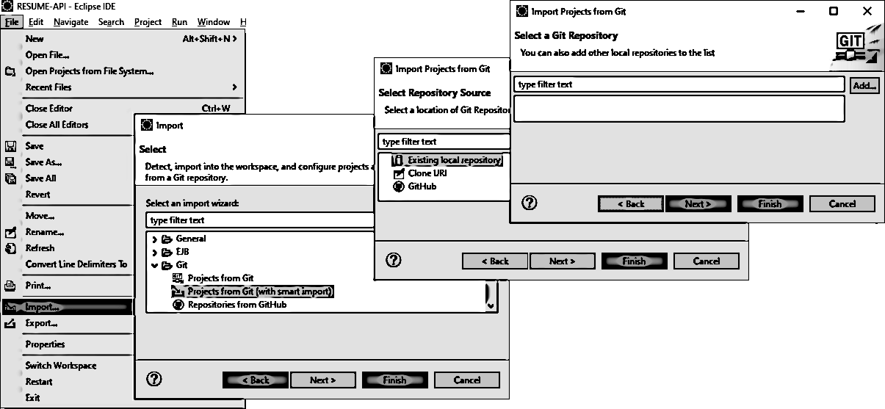
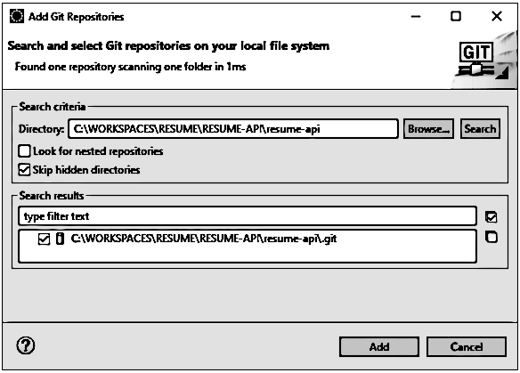
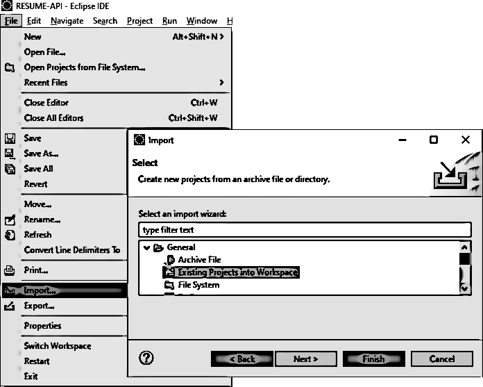
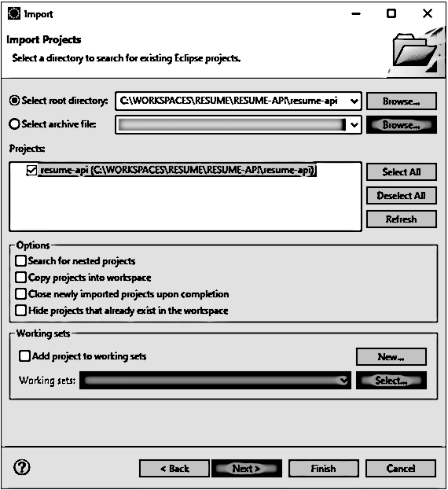
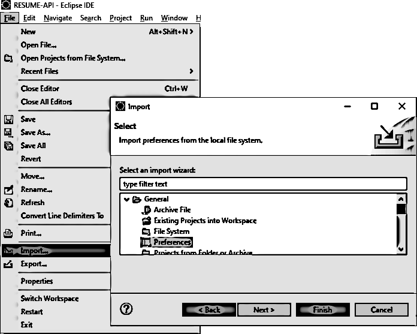
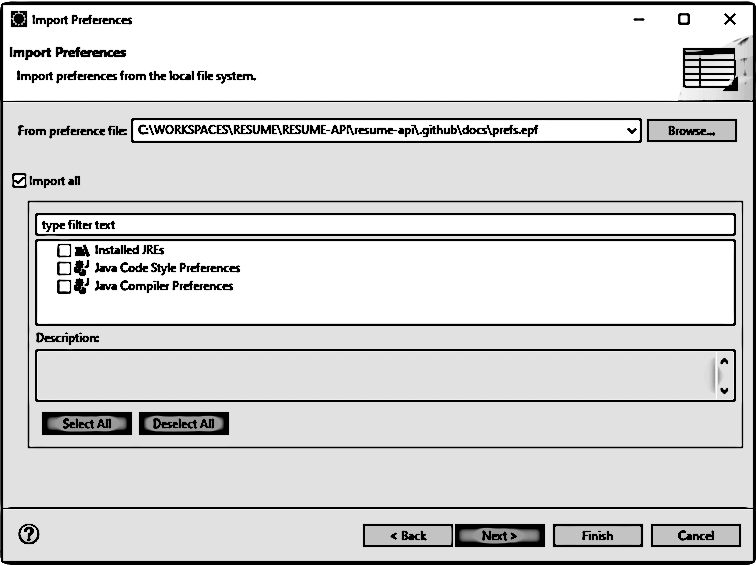
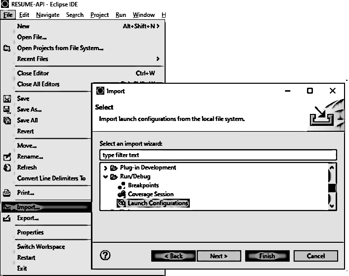
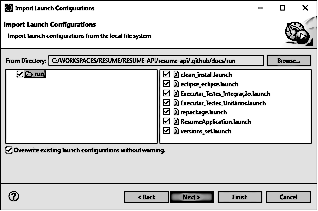
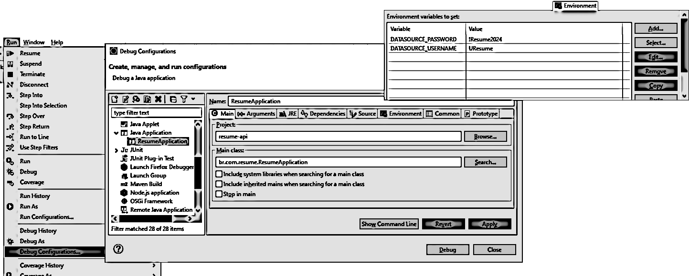

    <h3>Guia Simples para Configurar o Ambiente de Desenvolvimento no Eclipse</h3>
    

        Este guia explica de forma simples como configurar o Eclipse para desenvolver um projeto, incluindo a importação de um repositório e execução do projeto. Siga estas instruções para garantir que o ambiente esteja pronto para o desenvolvimento.
    

    
<strong>Pré-requisitos:</strong>

    

        Certifique-se de que já clonou o repositório do projeto e configurou o ambiente seguindo as instruções iniciais. Se ainda não fez isso, consulte a seção <a href="../README.md#6-como-executar-o-projeto">6</a> do <strong>README</strong> para instruções de clonagem, build e execução do projeto.
        

    <blockquote>
        
⚠️ <strong>Atenção:</strong>

        

            Siga todas as etapas para que o ambiente esteja corretamente configurado e sem erros.
        

    </blockquote>
    <h4>Como Importar o Repositório no Eclipse</h4>
    

        Abra o Eclipse. Se não tiver um workspace configurado, escolha um local. Informe o caminho onde o repositório foi clonado, como <code>C:\WORKSPACES\RESUME\RESUME-API\</code>, de acordo com a seção <a href="../README.md#6-como-executar-o-projeto">6</a> do <strong>README</strong>.
    

    <blockquote>
        
💡 <strong>Dica:</strong>

        

            Se ainda não instalou o Eclipse, baixe-o <a href="https://www.eclipse.org/downloads/download.php?file=/technology/epp/downloads/release/2024-09/R/eclipse-jee-2024-09-R-win32-x86_64.zip" target="_blank">aqui</a> e siga as instruções de instalação.
        

    </blockquote>
    <h4>Importando o Repositório Já Clonado</h4>
    

        No Eclipse, vá em <code>File &gt; Import...</code>. Em <strong>Git</strong>, selecione <strong>Projects from Git (with smart import)</strong> e clique em <code>Next &gt;</code>. Escolha <strong>Existing local repository</strong> e clique em <code>Next &gt;</code>. Em seguida, clique em <strong>Add...</strong>.
    

    

        <picture>
            
        </picture>
        
Import Projects from Git

    

    

        Selecione o repositório em <code>C:\WORKSPACES\RESUME\RESUME-API\resume-api</code>, marque a caixa ao lado do repositório e clique em <strong>Add</strong>.
    

    

        <picture>
            
        </picture>
        
Add Git Repositories

    

    <h4>Importar o Projeto no Eclipse</h4>
    

        Vá novamente em <code>File > Import...</code>, expanda <strong>General</strong> e selecione <strong>Existing Projects into Workspace</strong>. Clique em <code>Next ></code>.
    

    

        <picture>
            
        </picture>
        
Import Projects

    

    

        Selecione o diretório do projeto em <code>C:\WORKSPACES\RESUME\RESUME-API\resume-api</code>. Na seção <strong>Projects</strong>, marque <strong>resume-api</strong> e clique em <code>Finish</code>.
    

    

        <picture>
            
        </picture>
        
Eclipse Import Projects

    

    <h4>Importando Preferências de Estilo de Código</h4>
    

        Vá em <code>File > Import...</code>, expanda <strong>General</strong> e escolha <strong>Preferences</strong>. Clique em <code>Next ></code>.
    

    

        <picture>
            
        </picture>
        
Import Preferences

    

    

        Clique em <strong>Browse...</strong> e encontre o arquivo de preferências em <code>C:\WORKSPACES\RESUME\RESUME-API\resume-api\.github\docs\resume_preferences.epf</code>. Selecione o arquivo, marque <strong>Import all</strong> e clique em <code>Finish</code>.
    

    

        <picture>
            
        </picture>
        
Import Preferences

    

    <blockquote>
        
⚠️ <strong>Atenção:</strong>

        

            Após importar, o Eclipse pedirá para reiniciar. Clique em <strong>Restart</strong> para aplicar as configurações.
        

    </blockquote>
    <h4>Importando Configurações de Launch</h4>
    

        Vá em <code>File > Import...</code> e escolha <strong>General > Run/Debug > Launch Configurations</strong>, depois clique em <code>Next ></code>.
    

    

        <picture>
            
        </picture>
        
Import Launch

    

    

        Clique em <strong>Browse...</strong>, selecione o arquivo de configuração em <code>C:\WORKSPACES\RESUME\RESUME-API\resume-api\.github\docs\run</code>. Marque as configurações desejadas e clique em <strong>Finish</strong>.
    

    

        <picture>
            
        </picture>
        
Import Launch

    

    <h4>Executando o Projeto no Eclipse</h4>
    

        Para executar o projeto, vá em <strong>Run</strong>, depois em <strong>Run As &gt; Debug Configurations...</strong>. Na janela de configurações, expanda <strong>Java Application</strong>, selecione <strong>ResumeApplication</strong> e clique em <code>Debug</code>.
    

    <blockquote>
        
💡 <strong>Dica:</strong>

        

            Na aba Environment, configure as credenciais do banco H2 em <code>DATASOURCE_USERNAME</code> e <code>DATASOURCE_PASSWORD</code>.
        

    </blockquote>
    

        <picture>
            
        </picture>
        
Debug Configurations

    

    
Seguindo essas etapas, o projeto deve estar pronto para rodar sem problemas no Eclipse.

